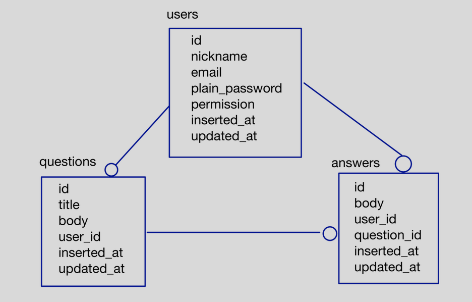

# absinthe_showcase
This is a showcase for Absinthe

## Features
- mutations
  - login with email and password; supports two permissions
    - normal user
    - admin user
  - create user account
    - admin user can create new accounts with mutation
      - no login(guests) or normal users are rejected
- query
  - various queries includes total record counts

## How to try this?
- build docker compose
  - [How to build Docker Compose?](docs/docker.md)
- setup table and seed data
  - `mix ecto.setup`
- access graphiql
  - `http://localhost:5001/graphiql`
- Enjoy!

## Schemas

- permission: 0 = normal user, 1 = admin user

## Queries and Mutations
- 

